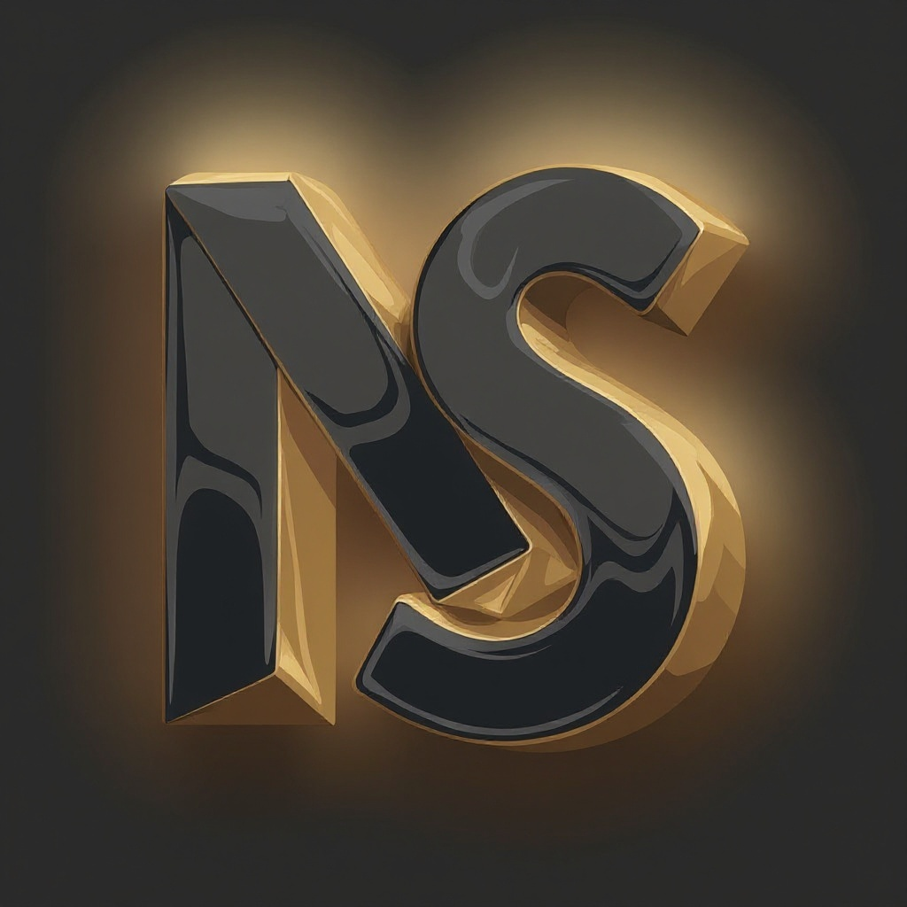

#  Northspec Studio

Northspec Studio is a high-end engineering partner specializing in durable software, workflow automation, and senior-level execution. This repository contains the complete ecosystem: a public-facing website, an internal administration dashboard, and a robust backend API.

## Project Structure

The project is organized into three primary components:

- **[FrontEnd/](FrontEnd/)**: Public website built with **Next.js 15**, **React 19**, and **Framer Motion**. Features a premium, animated UI and a functional recruitment portal.
- **[BackEnd/](BackEnd/)**: **Node.js** & **Express** REST API. Manages data for contacts, job applications, prospects, and integrations (Plaid, Google Drive, n8n).
- **[Dashboard/](Dashboard/)**: Internal administration tool built with **Next.js 16**. Used for managing leads, finances, and project workflows.

## Tech Stack

### Frontend & Dashboard
- **Framework**: Next.js (15/16) with App Router
- **Styling**: Tailwind CSS
- **Animations**: Framer Motion
- **State Management**: React Context API
- **Integrations**: Plaid Link, Google Drive API

### Backend
- **Runtime**: Node.js
- **Framework**: Express.js
- **Database**: MongoDB Atlas (via Mongoose)
- **Automation**: n8n (Workflow integration)
- **File Handling**: Multer

## Key Features

- **Premium UI/UX**: Staggered animations and glassmorphism design language.
- **Recruitment Pipeline**: Functional careers page with automated job application storage.
- **Workflow Automation**: Deep integration with n8n for business process automation.
- **Financial Integration**: Plaid-powered account and invoice management.
- **Lead Management**: Automated prospect enrichment and contact routing.

## Getting Started

### Prerequisites

- **Node.js**: v20+ recommended
- **MongoDB**: Connection string for MongoDB Atlas or local instance
- **Environment Variables**: Each directory requires its own `.env` file.

### Installation

```bash
# Install all dependencies
cd BackEnd && npm install
cd ../FrontEnd && npm install
cd ../Dashboard && npm install
```

### Running the Applications

You will need three terminal sessions to run the full stack:

#### 1. Backend API (Port 4000)
```bash
cd BackEnd
npm run dev
```

#### 2. Public Website (Port 3000)
```bash
cd FrontEnd
npm run dev
```

#### 3. Admin Dashboard (Port 3001)
```bash
cd Dashboard
npm run dev
```

## License

© 2026 Northspec Studio. All rights reserved.
